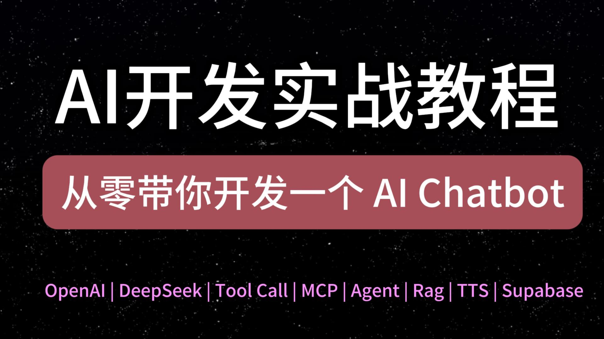

## AI 开发实战教程

这套AI开发实战教程，从零带你开发一个 ChatGPT 一样的 AI Chatbot。
后续内容有：OpenAI 库的使用、Vercel AI SDK、agent 开发、toolcall、tts、MCP、Rag 等等。

### 目录

- #### 第一课：SSE 是什么？实现像打字机一样的流式输出
  - [视频教程](https://www.youtube.com/watch?v=hOMi2W50i-g)
  - [代码分支](https://github.com/liruifengv/ai-chatbot-tutorial/tree/p-1)
- #### 第二课：前端怎么解析流式响应结果。eventsource-parser 解析库使用
  - [视频教程](https://www.youtube.com/watch?v=Za_bEqNC9xk&t=54s)
  - [代码分支](https://github.com/liruifengv/ai-chatbot-tutorial/tree/p-2)
- #### 第三课：接入 OpenAI API
  - [视频教程](https://www.youtube.com/watch?v=sUiDMUyhC6Q&t=1s)
  - [代码分支](https://github.com/liruifengv/ai-chatbot-tutorial/tree/p-3)
- #### 第四课：实现联系对话 ChatBot
  - [视频教程](https://www.youtube.com/watch?v=859gjQd9R04&t=13s)
  - [代码分支](https://github.com/liruifengv/ai-chatbot-tutorial/tree/p-4)

### LICENSE

本仓库代码采用 MIT 协议，详见 LICENSE 文件。

视频和文字教程采用[CC BY-NC-SA 4.0协议](https://creativecommons.org/licenses/by-nc-sa/4.0/deed.zh-hans)。
